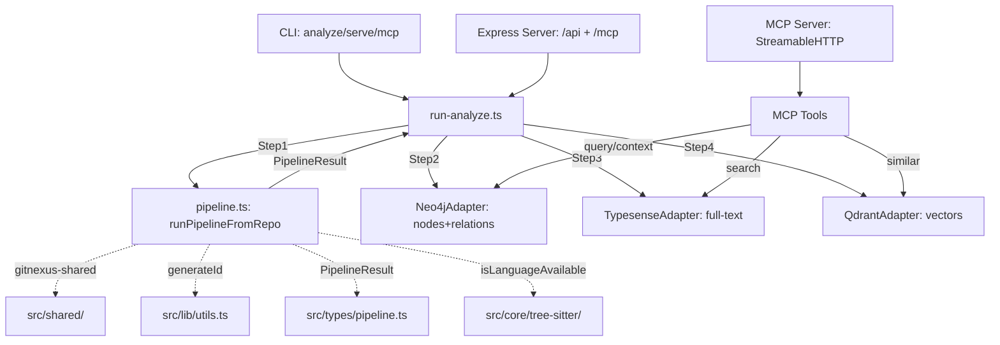

## 产品概述

jelly_code_project 是一个代码知识图谱云服务，基于 GitNexus 代码复制并替换 LadybugDB 为 Neo4j+Typesense+Qdrant 三后端架构，支持双模式部署（Jelly 集成 / Standalone）。当前需要完成 4 个关键任务使项目从"代码存在但不可用"状态变为可运行的 MCP 服务。

## 当前状态

- **已完成**: 存储抽象层(95%)、认证系统(100%)、配置系统(100%)、Docker部署(100%)、HTTP REST API(80%)、分析管线编排 Step2-4(100%)
- **关键缺口**: 管线未接入(Step1 throw Error)、MCP 完全缺失(0%)、编译排除 5 个核心模块、无测试、无文档

## 核心功能

1. **接线 ingestion pipeline** — 解决 5 类外部依赖，将 pipeline.ts 的 `runPipelineFromRepo()` 接入 run-analyze.ts，使代码分析流程真正可运行
2. **MCP 工具实现** — 基于已有 store 接口实现 7+ 个 MCP 工具（list_repos、query、context、impact、search、similar、detect_changes）
3. **MCP HTTP 传输** — 接入 @modelcontextprotocol/sdk 的 StreamableHTTP，实现 /mcp 端点和 stdio 传输
4. **E2E 测试** — 用实际仓库验证完整流程：analyze → store → search → MCP query

## 技术栈

- 语言: TypeScript 5.7+ (ES2022, Node16 module)
- 运行时: Node.js 20
- 存储: Neo4j 5.27 + Typesense 0.26 + Qdrant v1.12
- MCP: @modelcontextprotocol/sdk ^1.12.0 (StreamableHTTP)
- Web: Express 4.21 + CORS
- 代码解析: tree-sitter 0.21 + 12 语言绑定
- 图算法: graphology 0.25
- 嵌入: @huggingface/transformers + onnxruntime-node
- 测试: vitest 2.1
- 构建: tsc, Docker multi-stage

## 实施方案

### 核心策略: 依赖解耦 → 编译修复 → 功能接入 → 验证

**关键问题**: `src/core/ingestion/` 有 ~80 个文件从 GitNexus 复制而来，包含 5 类外部依赖引用，导致被 tsconfig exclude 排除编译。必须先解决依赖才能接入管线。

**5 类外部依赖及解决方案**:

| 外部依赖 | 引用次数 | 本地替代 | 方案 |
| --- | --- | --- | --- |
| `gitnexus-shared` | 71+ 处 | `src/shared/index.ts` 已有等价导出 | tsconfig paths 映射 `gitnexus-shared` → `./src/shared/index.js` |
| `../../lib/utils.js` (generateId) | ~15 文件/179 处调用 | 不存在 | 新建 `src/lib/utils.ts`，实现 `generateId(label, key) => string` |
| `../../types/pipeline.js` (PipelineResult) | 1 处 | 不存在 | 新建 `src/types/pipeline.ts`，从 run-analyze.ts 的 PipelineResult 接口搬移 |
| `../tree-sitter/parser-loader.js` | 6 文件 | 空目录 | 新建 `src/core/tree-sitter/parser-loader.ts`，实现 `isLanguageAvailable()` |
| `../graph/graph.js` | 1 处(pipeline.ts) | 存在于 `src/core/graph/graph/graph.ts` | 路径修正 |


**最优方案: tsconfig paths 映射 + 最小化文件创建**

使用 tsconfig `paths` 将 `gitnexus-shared` 映射到 `src/shared/index.ts`，这样无需修改 71+ 个文件的 import 语句。其余 4 类依赖各需创建 1 个小文件。

### 架构设计



### MCP 工具设计 (7 个)

| 工具名 | 输入 | Store 接口 | 说明 |
| --- | --- | --- | --- |
| `list_repos` | 无 | IGraphStore.listProjects | 列出所有项目 |
| `query` | projectId, cypher | IGraphStore.query | 执行 Cypher 查询 |
| `search_code` | projectId, query, limit? | ISearchStore.search | 全文搜索 |
| `similar_code` | projectId, nodeId, k? | IVectorStore.search | 语义搜索 |
| `context` | projectId, nodeId, depth? | IGraphStore + ISearchStore | 符号上下文 |
| `impact` | projectId, nodeIds, depth? | IGraphStore.bfsTraverse | 影响分析 |
| `detect_changes` | projectId, changedFiles | IGraphStore + ISearchStore | 变更检测 |


## 目录结构

```
jelly_code_project/
├── src/
│   ├── lib/
│   │   └── utils.ts                      # [NEW] generateId() 函数，替代 ../../lib/utils.js
│   ├── types/
│   │   └── pipeline.ts                   # [NEW] PipelineResult 类型定义，从 run-analyze.ts 搬移
│   ├── core/
│   │   ├── tree-sitter/
│   │   │   └── parser-loader.ts          # [NEW] isLanguageAvailable() 函数
│   │   ├── run-analyze.ts               # [MODIFY] 接入 pipelineRunner，搬移 PipelineResult
│   │   ├── ingestion/                    # [MODIFY] 编译路径修复后从 exclude 移除
│   │   ├── graph/                        # [MODIFY] gitnexus-shared → 本地引用
│   │   ├── embeddings/                   # [MODIFY] 从 exclude 移除
│   │   └── search/
│   ├── mcp/
│   │   ├── server.ts                     # [NEW] MCP Server 主文件 (StreamableHTTP + stdio)
│   │   ├── tools/
│   │   │   ├── index.ts                 # [NEW] 工具注册入口
│   │   │   ├── list-repos.ts            # [NEW] list_repos 工具
│   │   │   ├── query.ts                 # [NEW] query 工具 (Cypher)
│   │   │   ├── search-code.ts           # [NEW] search_code 工具
│   │   │   ├── similar-code.ts          # [NEW] similar_code 工具
│   │   │   ├── context.ts               # [NEW] context 工具
│   │   │   ├── impact.ts                # [NEW] impact 工具
│   │   │   └── detect-changes.ts         # [NEW] detect_changes 工具
│   │   └── local/                        # [DELETE] 空目录，被 mcp/server.ts 替代
│   ├── server/
│   │   └── index.ts                      # [MODIFY] /mcp 端点接入 MCP Server
│   ├── cli/
│   │   └── index.ts                      # [MODIFY] mcp 命令接入 stdio transport
│   └── shared/                            # [MODIFY] 确保导出与 gitnexus-shared 完全一致
├── test/
│   ├── e2e/
│   │   └── full-pipeline.test.ts         # [NEW] 端到端测试
│   ├── integration/
│   │   ├── mcp-tools.test.ts            # [NEW] MCP 工具集成测试
│   │   └── pipeline-wiring.test.ts       # [NEW] 管线接入集成测试
│   └── unit/
│       ├── mcp-server.test.ts            # [NEW] MCP Server 单元测试
│       └── generate-id.test.ts          # [NEW] generateId 单元测试
├── tsconfig.json                          # [MODIFY] paths 映射 + 移除 exclude
├── README.md                              # [NEW] 项目文档
└── .env.example                           # [MODIFY] 补充新环境变量
```

## 实施要点

### 1. tsconfig paths 映射 (最关键)

```
{
  "compilerOptions": {
    "paths": {
      "@/*": ["./src/*"],
      "gitnexus-shared": ["./src/shared/index.ts"]
    }
  }
}
```

这避免了修改 71+ 个文件的 import 语句。运行时需配合 tsconfig-paths 或 Node16 的条件导出。

### 2. generateId 实现

GitNexus 的 generateId 逻辑: `label:key` 格式，如 `File:src/index.ts`、`CALLS:id1->id2`。需确保哈希一致性（如果 GitNexus 用哈希截断的话）。

### 3. PipelineResult 类型搬移

从 run-analyze.ts 的内联 PipelineResult 接口搬到 src/types/pipeline.ts，然后两个文件共用。需确保字段与 pipeline.ts 的 `runPipelineFromRepo` 返回值匹配。

### 4. MCP SDK 集成

使用 @modelcontextprotocol/sdk ^1.12.0 的 `McpServer` + `StreamableHTTPServerTransport`。Express 端通过中间件将请求转发给 MCP Server。

### 5. 编译排除移除顺序

必须分步验证：先移除 shared → 编译通过 → 再移除 ingestion → 编译通过 → 最后移除 graph/embeddings/augmentation。每步验证 `tsc --noEmit` 通过。

### 6. 性能考量

- pipeline.ts 的 tree-sitter 解析是 CPU 密集型，应使用 Worker Pool（代码中已有 createWorkerPool）
- MCP 工具调用是 I/O 密集型（Neo4j/Typesense/Qdrant），无性能瓶颈
- 向量嵌入使用本地 ONNX 模型，首次加载约 2-3 秒，后续缓存